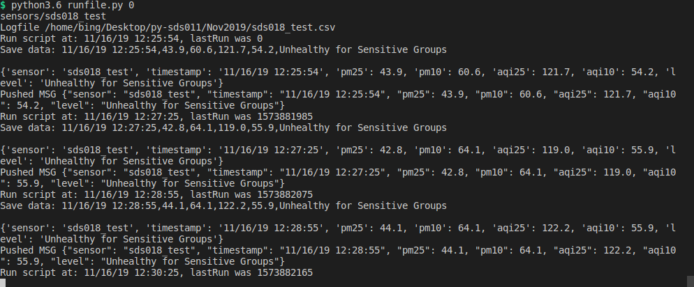
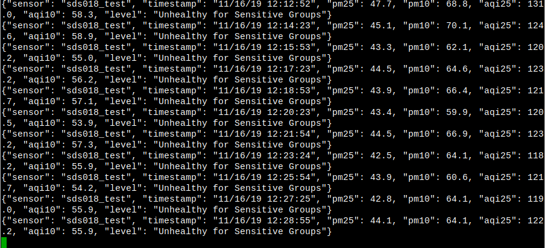

# nova_fitness_sds011
- Script in Python3.6 for air quality sensor (Nova Fitness SDS011, SDS018), save data in .CSV file or push to MQTT server
- the script works with Python3.6 without modifying `print` or any Python3 (have to modify `print`)
- work with SDS011 and SDS18. These are sensors measuring coarse and fine susppended particulate matter in the air (PM2.5, PM10) using light-scattering method.
- to run the script, check the USB port. In linux, the port can be found by `ls /dev/ttyUSB*`
- run `python3.6 runfile.py 0`
# config 
in the **runfile**, scroll to near the bottom,
```
    while True:
        schedule(snapTime=60, push_mqtt=True)
```
- flag `push_mqtt=True` by defaut. So the line about could be simplify as:
```
     while True:
            schedule(snapTime=60)
```
and only necessary when you don't to push data to MQTT server as:

```
    while True:
        schedule(snapTime=60, push_mqtt=False)
```

- You could change `snapTime` to anyvalue. This is the time the sensor sleeping in second.
- Before measursing, the script turns on the **fan** for **30 seconds** to purge out the old air
## here is what looks like in CLI:
<p align="center">
  
</p>

## The CSV file stored data locally
[CSV file](https://github.com/binh-bk/nova_fitness_sds011/blob/master/Nov2019/sds018_test.csv)

## if the MQTT is enabled through the flag `push_mqtt=True`, here is the data in the server
<p align="center">
  
</p>

##TODO
- add datasheet
- some photo about SDS011
